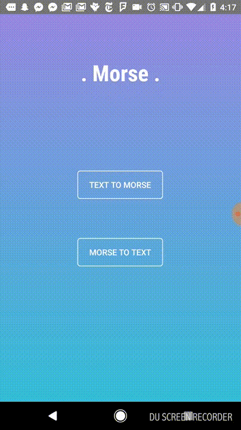

# Morse Android app

Prototype built over a month as a monthly challenge to myself.

Concept: Android app to **translate text into Morse code** and **Morse code into text** using **Computer Vision**.

End result:

Status:

* Text into Morse code using the flashlight is working well.
* Numbers and special characters are not supported.
* Morse code into text only tested with 1 word (and not fully working).
